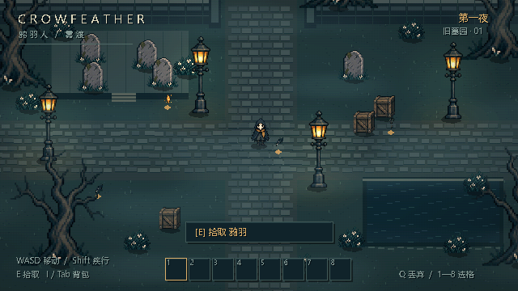

# CrowFeather<br>鸦羽人


**你只是路过并做出选择**

*头顶响起鸦叫声，路灯为谁点亮？<br>
雾气愈发浓厚，丧钟为谁而鸣？*

基于 Godot 开发的独立游戏

当前开发方向：**2D 像素风、2.5D 正视角**。使用 Godot 4.6.3 打开 `godot-game/crow-feather/project.godot`，按 F5 运行新原型。主场景为 `scenes/PixelMain.tscn`。

已实现像素场景、基础精灵与行走动画、八方向移动、雾效与水面 shader、拾取和八格背包。操作、实现说明与验证命令见 [像素原型说明](docs/PIXEL_PROTOTYPE.md)。


# CrowFeather

像素风 2.5D 正视角探索游戏原型，使用 Godot 4.6.3。项目包含键盘与触屏操作、拾取和简易背包。

## 平台

- Android：ARM64 APK，横屏触控操作
- Windows：x86_64
- Linux：x86_64

Godot 项目位于 `godot-game/crow-feather`。使用 Godot 4.6.3 打开，在 Project → Export 中选择对应预设。命令行示例：

```sh
mkdir -p dist/windows dist/linux dist/android
cd godot-game/crow-feather
godot --headless --export-release "Windows Desktop"
godot --headless --export-release "Linux/X11"
godot --headless --export-debug Android
```

导出前需安装与 Godot 4.6.3 完全匹配的 export templates。Android 导出另外需要 JDK 17 和 Android SDK。预设和构建说明见 [平台导出指南](docs/PLATFORMS.md)。
