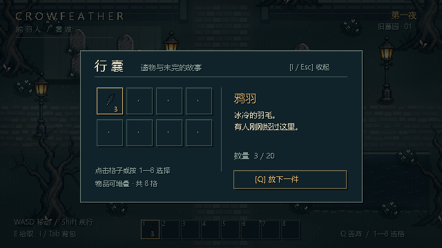

# 鸦羽人：2D 像素原型

使用 Godot **4.6.3** 打开 `godot-game/crow-feather/project.godot`，F5 运行。主场景为 `res://scenes/PixelMain.tscn`，采用 Compatibility 渲染器。旧的 3D 主场景仍保留在仓库，但已不再作为游戏入口。

## 操作

| 按键 | 功能 |
| --- | --- |
| WASD | 八方向地面移动 |
| Shift | 疾行 |
| E | 拾取脚边最近的遗物 |
| I / Tab | 打开、关闭背包 |
| Esc | 关闭背包 |
| 1–8 / 鼠标 | 选择背包格子 |
| Q / 背包的放下按钮 | 放下一件选中物品，可重新拾取 |

背包共八格，鸦羽每格 20、余烬每格 10、钥匙每格 1。满背包时只收取能装下的数量，剩余物品留在地上。背包打开后角色立即停止。当前原型的物品状态只保留在本次运行中，尚未加入存档和剧情。

## 渲染与资源

- 640×360 逻辑画布，默认窗口 1280×720，整数缩放、Nearest 采样和像素坐标吸附。保持宽高比，避免拉伸像素。
- 固定正交视角：角色与道具直立，地面纵向移动压缩到 0.72，脚底位置参与 Y 排序；角色与路灯、木箱、墓碑、边界和池塘均有 2D 碰撞。
- `scripts/pixel/world.gd` 创建旧墓园测试场地；`player.gd` 处理移动和方向动画；`art.gd` 定义图集裁切及脚底锚点；`hud.gd` 显示快捷栏和背包。
- `shaders/pixel_atmosphere.gdshader` 在 UI 之前处理冷色缓慢移动的雾、暗角和有序抖动；`pixel_water.gdshader` 生成像素水纹。UI 不受雾效影响。
- 基础精灵使用 `art/pixel/crowfeather_atlas.png`，包含八个角色方向/步态帧、路灯、墓碑、木箱、树、灌木、鸦羽、余烬和钥匙。背面步态目前为两帧，属于原型资源。
- 背包复用 `scripts/items/Inventory.gd`，补充了无效数量和不可堆叠物品的边界处理。

## 验证

在 Godot 项目目录运行：

```powershell
& "$env:LOCALAPPDATA\Programs\Godot\4.6.3\Godot_v4.6.3-stable_win64_console.exe" --headless --path . --script res://tests/pixel_smoke.gd
```

测试覆盖：无效物品/负数数量、堆叠溢出、背包满、不可堆叠物品、拾取/丢弃/回收、移动与停止、背包输入锁定、池塘碰撞，以及部分拾取时剩余数量保留。

通过 `godot-crowfeather` MCP 创建主场景、附加脚本、配置渲染设置、启动游戏并检查运行状态与截图。MCP 插件本地修正了编辑器端输入队列写入和鼠标抬起事件复用问题，保证模拟输入实际进入游戏。



