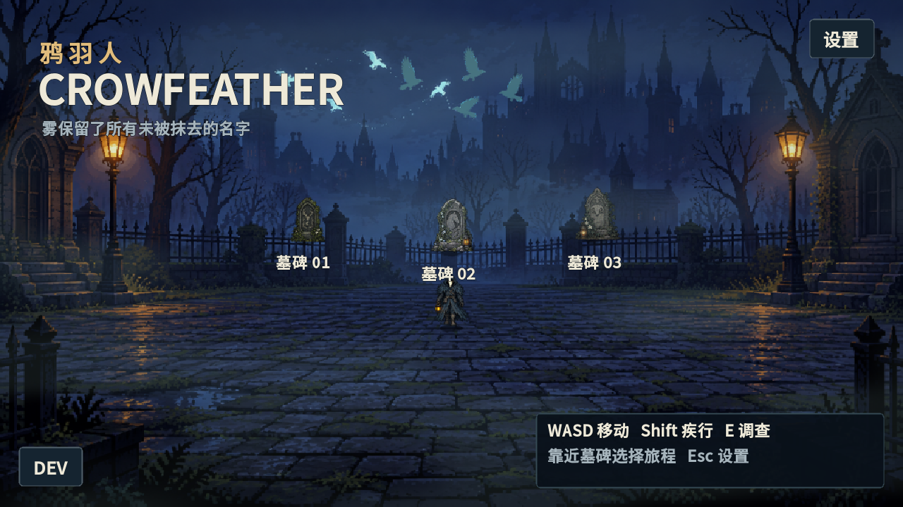
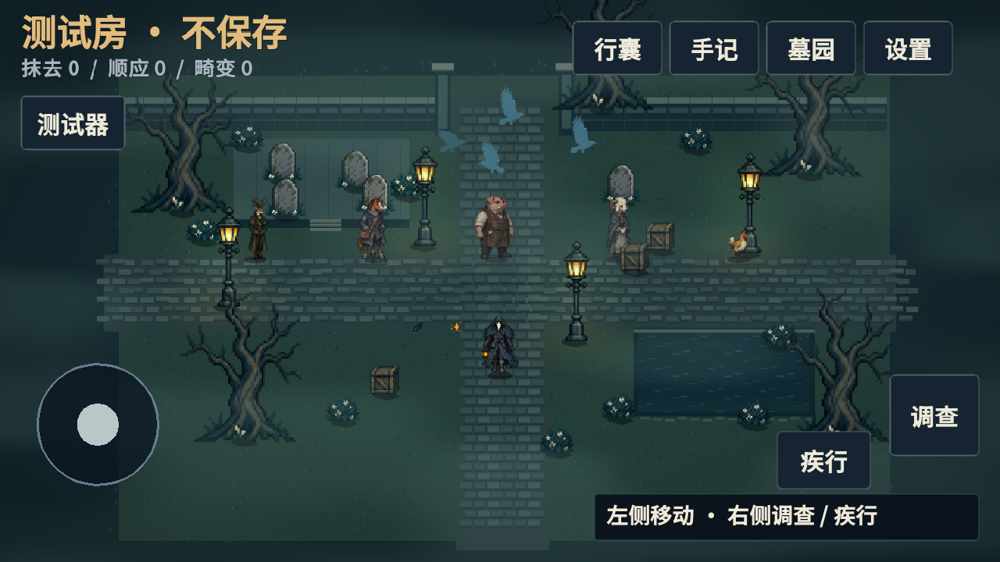
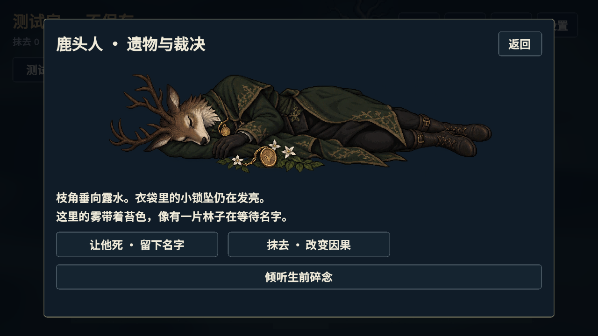

# 鸦羽人：像素叙事原型 1.1

Godot **4.6.3**，Compatibility 渲染器。项目 godot-game/crow-feather，入口 scenes/PixelMain.tscn。旧 lowpoly / 第一人称素材仅为历史内容。

## 墓园与存档

启动后在宣传图风格的墓园行走，靠近三座墓碑并调查，开始或继续对应旅程。每座墓碑是独立存档。位置、区域、背包、地上物品、剧情节点、裁决与因果标记持久化；每 12 秒及关键操作后自动保存，退出或进入后台时也会保存。

存档在 Godot 的 user://saves，Windows 对应 %APPDATA%/Godot/app_userdata/CrowFeather/saves。采用临时文件替换与上一版 .bak，主文件损坏时读取备份。设置独立保存为 user://settings.json。

## 操作与设置

| 操作 | 功能 |
| --- | --- |
| WASD / 左侧摇杆 | 八方向地面移动 |
| Shift / 疾行开关 | 疾行 |
| E / 调查 | 墓碑、遗体调查与拾取 |
| I / Tab / 行囊 | 八格背包 |
| Q / 放下按钮 | 放下一件物品，可回收 |
| J / 手记 | 剧情进度与合法下一节点 |
| Esc / 设置 | 设置或关闭当前窗口 |

提示固定右下角，可隐藏。独立高对比文字层与 Noto Sans SC，提供 85%–130% UI 缩放。手机摇杆、调查、疾行分开布置，支持多点触控，开窗口或失去焦点会释放输入。

可关闭动态环境（雾、水纹、鸦群运动并固定镜头）、关闭强光效果（抹去发光与仪式雾幕），调整 BGM / 音效。桌面另有窗口化、窗口化全屏、独占全屏和四种窗口分辨率。当前 BGM 为程序生成的氛围声占位资源。

## 渲染与故事

960×540 逻辑布局，纹理最近邻采样，UI 清晰缩放。脚底 Y 排序，地面纵向移动压缩为 0.72。主角有前、后、侧向四帧行走，按实际位移播放，撞墙不原地踏步。

鹿头人、三腿马人、猪头人、羊人、普通鸡具有站立、对话、行走、死亡、遗体特写与墓碑；鸡只呈现叫声和动作。新增鹿头人与原长颈鹿区分。

五区为苔绿、冷蓝、暗红、紫、赭色雾。裁决影响剧情标记、道具和畸变；畸变增加鸦群和雾，抹去逐渐推向死白。抹去有跪地、像素消散发光和环境过渡，乌鸦飞行并在暖灯附近转黑。

目前为五处调查样章和可扩展分支回归框架；新增片段是原型文案，完整章节、对白和结局演出仍待创作。原始概念文档未改写。见 [剧情与接口](NARRATIVE_SYSTEM.md)、[美术资源](ART_ASSETS.md)。

## 测试房

主界面连续点击 **DEV 三次**，相邻点击不超过两秒。集合五个角色、动画状态、特写、区域调色、裁决、抹去、乌鸦、背包、剧情 / Agent 校验、触屏模拟和存档保护测试器。房间不写入正式旅程存档，离开丢弃房间状态；全局设置仍按用户选择保存。

在仓库根目录执行：

```powershell
& "$env:LOCALAPPDATA\Programs\Godot\4.6.3\Godot_v4.6.3-stable_win64_console.exe" --headless --path godot-game/crow-feather --script res://tests/narrative_smoke.gd
```

测试使用独立临时存档目录，覆盖替换、损坏备份恢复、三槽隔离、沙盒写盘保护、分支回归、无效 Agent 回退、结局计数、背包、移动碰撞、触控释放和舒适性设置。开发与截图检查通过 godot-crowfeather MCP。




