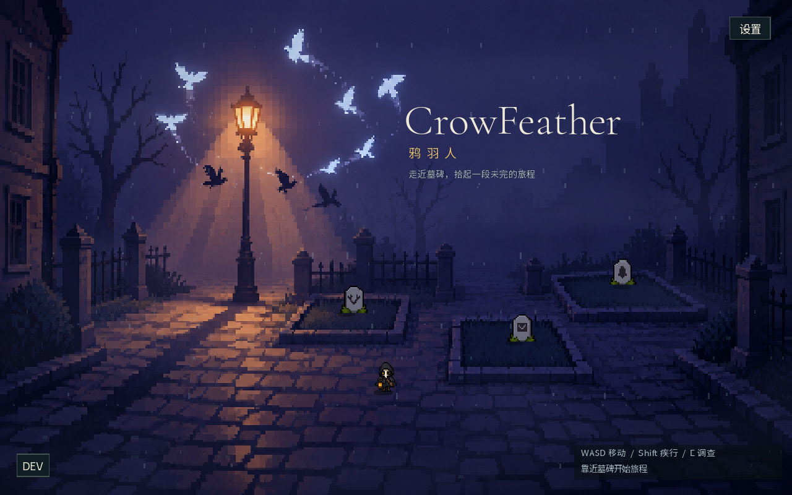
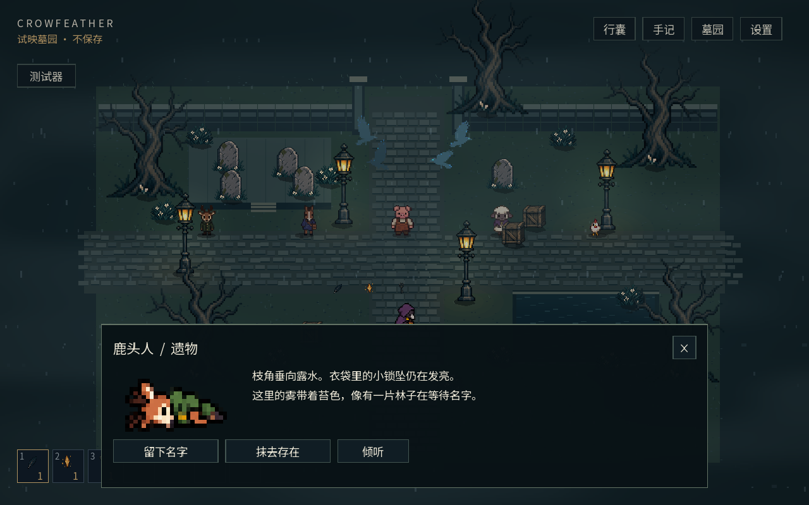
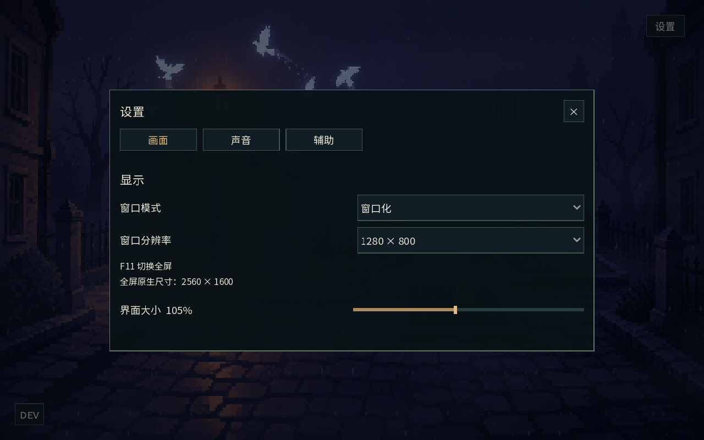
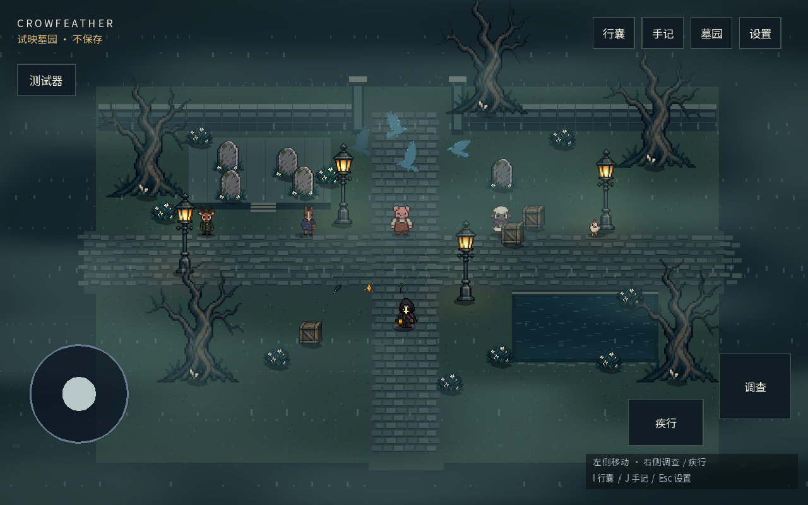

# 1.2 低像素视觉重整

## 本轮变化

- 主角与五类角色重绘为低像素四方向图集：列为下、右、上、左，行为站立、迈步 A、迈步 B、说话。运行时人物高度栅格为 28 像素、鸡为 16 像素，最近邻放大；按透明行带识别裁切，避免切掉头脚。
- memorial-v2.png 统一跪地、遗体、墓碑；角色站立和遗体保持相同轮廓与服装。第一版高细节图保留为历史素材。
- 首页使用宣传图的暖路灯、蓝紫雾和鸦群构图，三份存档墓碑落在预留墓地中，只在靠近时显示文字。
- UI 恢复细直角边框、轻字重、紧凑按钮；调查 / 对话为底部面板，世界保持可见。设置分为画面、声音、辅助三页。
- 双层雨滴、地面涟漪、分层流动雾；测试器可选晴夜、细雨、浓雾、雨雾。关闭动态环境会隐藏雨滴并冻结雾、水面、鸦群。
- F11 切换全屏；窗口分辨率按当前显示器宽高和比例动态生成，不再固定四项。全屏使用显示器原生尺寸，不改操作系统的视频模式。

## 验证

Windows 独立游戏窗口实际往返测试：窗口化 mode=0、窗口化全屏 mode=3、独占全屏 mode=4。此设备原生 2560×1600；动态窗口列表为 1280×800、1600×1000、1920×1200、2240×1400、2560×1600。换设备时按其屏幕重新生成。

集成测试包含既有存档、剧情、触控、碰撞，以及六角色 × 四方向 × 四动作、遗体图像尺寸、设备分辨率边界、关闭雨效、130% UI 调查面板边界。手机截图来自桌面触屏模拟，安卓和 Linux 未做真机运行验证。

[Godot 4.6 DisplayServer 显示模式语义](https://docs.godotengine.org/en/4.6/classes/class_displayserver.html)。开发时应关闭编辑器嵌入游戏，独立窗口才可验证显示模式。

## 图像文件与原生生成提示

以下资源位于 `godot-game/crow-feather/art/characters/`，均用原生 image_gen 工具生成；没有使用 CLI 回退。参考宣传图为 `assets/images/宣传图海报.jpg`。图集的缩小、透明裁切和脚底锚定由 Godot 运行时负责。

### player-v2.png

```text
Draw a production game SPRITE SHEET on actual transparent background. a tiny crow-feather traveler, black hood and short charcoal feather cape, small pale face and amber lantern held consistently in right hand. Original character for gloomy CrowFeather game. VERY LOW PIXEL COUNT like classic Stardew Valley NPC sprites: each figure conceptually only 16 pixels wide and 24-32 pixels tall, fat square pixels, simple readable silhouette, 8-12 muted colors total, small head/body proportions like tiny SNES villagers. NOT detailed illustration, NOT fine dither, NOT realism. Render these tiny pixels as large crisp nearest-neighbor square blocks. EXACT regular 4 columns by 4 rows of equal cells across entire square sheet, no labels, no lines, no shadows, no scenery. Each cell figure at identical scale and identical foot baseline, with generous transparent separation. COLUMNS left to right = facing DOWN toward viewer, facing RIGHT profile, facing UP with back visible, facing LEFT profile. ROW 1 = standing idle in those four directions. ROW 2 = walking first foot contact in those four directions. ROW 3 = walking opposite foot contact in those four directions. ROW 4 = subtle speaking pose/wing gesture in those four directions. Maintain exact outfit, palette, head and body size across all 16 frames. True 4-direction sprite art, no diagonal views. This is a functional simple low-resolution game atlas, not a character concept illustration.
```

### deer-v2.png

```text
Draw a production game SPRITE SHEET on actual transparent background. a deer-headed villager, short branching antlers, simple dark green coat. Original character for gloomy CrowFeather game. VERY LOW PIXEL COUNT like classic Stardew Valley NPC sprites: each figure conceptually only 16 pixels wide and 24-32 pixels tall, fat square pixels, simple readable silhouette, 8-12 muted colors total, small head/body proportions like tiny SNES villagers. NOT detailed illustration, NOT fine dither, NOT realism. Render these tiny pixels as large crisp nearest-neighbor square blocks. EXACT regular 4 columns by 4 rows of equal cells across entire square sheet, no labels, no lines, no shadows, no scenery. Each cell figure at identical scale and identical foot baseline, with generous transparent separation. COLUMNS left to right = facing DOWN toward viewer, facing RIGHT profile, facing UP with back visible, facing LEFT profile. ROW 1 = standing idle in those four directions. ROW 2 = walking first foot contact in those four directions. ROW 3 = walking opposite foot contact in those four directions. ROW 4 = subtle speaking pose/wing gesture in those four directions. Maintain exact outfit, palette, head and body size across all 16 frames. True 4-direction sprite art, no diagonal views. This is a functional simple low-resolution game atlas, not a character concept illustration.
```

### horse-v2.png

```text
Draw a production game SPRITE SHEET on actual transparent background. a horse-headed postman with THREE legs, indigo simple coat and brown satchel. Original character for gloomy CrowFeather game. VERY LOW PIXEL COUNT like classic Stardew Valley NPC sprites: each figure conceptually only 16 pixels wide and 24-32 pixels tall, fat square pixels, simple readable silhouette, 8-12 muted colors total, small head/body proportions like tiny SNES villagers. NOT detailed illustration, NOT fine dither, NOT realism. Render these tiny pixels as large crisp nearest-neighbor square blocks. EXACT regular 4 columns by 4 rows of equal cells across entire square sheet, no labels, no lines, no shadows, no scenery. Each cell figure at identical scale and identical foot baseline, with generous transparent separation. COLUMNS left to right = facing DOWN toward viewer, facing RIGHT profile, facing UP with back visible, facing LEFT profile. ROW 1 = standing idle in those four directions. ROW 2 = walking first foot contact in those four directions. ROW 3 = walking opposite foot contact in those four directions. ROW 4 = subtle speaking pose/wing gesture in those four directions. Maintain exact outfit, palette, head and body size across all 16 frames. True 4-direction sprite art, no diagonal views. This is a functional simple low-resolution game atlas, not a character concept illustration.
```

### pig-v2.png

```text
Draw a production game SPRITE SHEET on actual transparent background. a pig-headed stocky villager in a rust brown apron. Original character for gloomy CrowFeather game. VERY LOW PIXEL COUNT like classic Stardew Valley NPC sprites: each figure conceptually only 16 pixels wide and 24-32 pixels tall, fat square pixels, simple readable silhouette, 8-12 muted colors total, small head/body proportions like tiny SNES villagers. NOT detailed illustration, NOT fine dither, NOT realism. Render these tiny pixels as large crisp nearest-neighbor square blocks. EXACT regular 4 columns by 4 rows of equal cells across entire square sheet, no labels, no lines, no shadows, no scenery. Each cell figure at identical scale and identical foot baseline, with generous transparent separation. COLUMNS left to right = facing DOWN toward viewer, facing RIGHT profile, facing UP with back visible, facing LEFT profile. ROW 1 = standing idle in those four directions. ROW 2 = walking first foot contact in those four directions. ROW 3 = walking opposite foot contact in those four directions. ROW 4 = subtle speaking pose/wing gesture in those four directions. Maintain exact outfit, palette, head and body size across all 16 frames. True 4-direction sprite art, no diagonal views. This is a functional simple low-resolution game atlas, not a character concept illustration.
```

### sheep-v2.png

```text
Draw a production game SPRITE SHEET on actual transparent background. a sheep-headed villager with cream wool head, simple muted purple shawl. Original character for gloomy CrowFeather game. VERY LOW PIXEL COUNT like classic Stardew Valley NPC sprites: each figure conceptually only 16 pixels wide and 24-32 pixels tall, fat square pixels, simple readable silhouette, 8-12 muted colors total, small head/body proportions like tiny SNES villagers. NOT detailed illustration, NOT fine dither, NOT realism. Render these tiny pixels as large crisp nearest-neighbor square blocks. EXACT regular 4 columns by 4 rows of equal cells across entire square sheet, no labels, no lines, no shadows, no scenery. Each cell figure at identical scale and identical foot baseline, with generous transparent separation. COLUMNS left to right = facing DOWN toward viewer, facing RIGHT profile, facing UP with back visible, facing LEFT profile. ROW 1 = standing idle in those four directions. ROW 2 = walking first foot contact in those four directions. ROW 3 = walking opposite foot contact in those four directions. ROW 4 = subtle speaking pose/wing gesture in those four directions. Maintain exact outfit, palette, head and body size across all 16 frames. True 4-direction sprite art, no diagonal views. This is a functional simple low-resolution game atlas, not a character concept illustration.
```

### chicken-v2.png

```text
Draw a production game SPRITE SHEET on actual transparent background. an ordinary small white and russet CHICKEN on two bird legs, NOT anthropomorphic, no clothes. Original character for gloomy CrowFeather game. VERY LOW PIXEL COUNT like classic Stardew Valley NPC sprites: each figure conceptually only 16 pixels wide and 24-32 pixels tall, fat square pixels, simple readable silhouette, 8-12 muted colors total, small head/body proportions like tiny SNES villagers. NOT detailed illustration, NOT fine dither, NOT realism. Render these tiny pixels as large crisp nearest-neighbor square blocks. EXACT regular 4 columns by 4 rows of equal cells across entire square sheet, no labels, no lines, no shadows, no scenery. Each cell figure at identical scale and identical foot baseline, with generous transparent separation. COLUMNS left to right = facing DOWN toward viewer, facing RIGHT profile, facing UP with back visible, facing LEFT profile. ROW 1 = standing idle in those four directions. ROW 2 = walking first foot contact in those four directions. ROW 3 = walking opposite foot contact in those four directions. ROW 4 = subtle speaking pose/wing gesture in those four directions. Maintain exact outfit, palette, head and body size across all 16 frames. True 4-direction sprite art, no diagonal views. This is a functional simple low-resolution game atlas, not a character concept illustration.
```

### menu-v2.png

```text
Reference image is the game's original promotional poster, use its composition, colors and atmosphere, NOT its text. Create a simple LOW RESOLUTION PIXEL ART playable cemetery environment backdrop for a 2D top-down frontal RPG title screen, 16:9 landscape. Very chunky pixel grid like 320x180 artwork enlarged nearest neighbor, limited midnight navy, dusty purple and muted amber palette, no intricate fine detail. One warm streetlamp at upper-left-center, silhouetted old town facades on far left/right, luminous crows in a restrained arc in purple blue fog above, open quiet cobbled path in lower half. No cathedral, no grand castle, no horror spectacle. Cemetery garden is integrated into the street edges: three EMPTY grass burial plots at screen normalized coordinates approximately (0.42,0.66), (0.61,0.72), (0.76,0.62), separated with low curbs and reachable paths; we will place game gravestone sprites on those plots so DO NOT PAINT GRAVESTONES. Reserve top-right third as quiet dark negative space for elegant title. No people, no UI, no letters, no text, no baked rain or fog particles. Painterly lighting must be translated to simple large pixel clusters with large clean dark shapes. Match the reference's intimate lamplit street, mysterious bluish-purple haze, and gentle amber pool of light.
```

### memorial-v2.png

```text
Create ONE transparent game sprite atlas with exactly 3 COLUMNS and 6 ROWS, regular equal tiles, no text no grid no background. Use the supplied images as character identity and simple low pixel count style references. Tiny 16x32 pixel RPG sprites enlarged with crisp square nearest neighbor blocks, 8-12 colors per character, very low detail, NOT illustrations. Each tile has generous transparent margins. ROWS top to bottom: 1 black hooded crow traveler with amber lantern; 2 antlered deer villager green coat; 3 horse postman indigo coat brown satchel THREE LEGS; 4 pig villager brown apron; 5 sheep villager purple shawl; 6 ordinary white russet chicken no clothes. COLUMNS: first column kneeling or collapsing peacefully, second column lying dead peacefully HORIZONTAL corpse closed eyes same short cute proportions with personal object no blood, third column simple small old stone headstone with a tiny recognizable emblem for that row. All corpses must be chunky simple side-lying RPG sprites ~32x16 pixels, never elongated realistic anatomical paintings. All tombstones small grey low-detail 16x24 pixel silhouettes. Maintain low pixel density and exact palette/clothing identity from references. Vertical format 1024x1536 or 2:3, perfectly equal grid cells 3 across by 6 down.
```

memorial-v2.png 追加编辑要求：去除所有背景和光晕，保留 3×6 布局、角色、颜色，背景为真实透明 alpha。已检查背景采样 alpha=0。

标题字体 art/fonts/CormorantGaramond.ttf 来源 google/fonts/ofl/cormorantgaramond，许可证为 Cormorant-OFL.txt；中文继续使用 Noto Sans SC。





